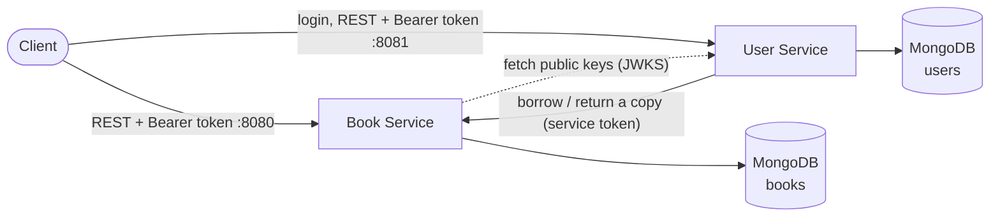

# Online Library Platform

A microservices library system for managing books, members and loans. It is built with
TypeScript, Express and MongoDB and runs in Docker. Over time it will grow into a complete
platform covering DevOps, data engineering and MLOps.

## About this project

This project started as **university coursework** for a DevOps and data module. The
original version was an online book-borrowing system with two Java Spring Boot
microservices, MongoDB and a plain HTML/JavaScript frontend. It was deployed to a
Kubernetes cluster provided by the university.

After the module, I **rebuilt it from scratch** as a portfolio project with three goals:

- **Own the whole stack.** Everything runs on my own machine and infrastructure, not on
  university servers.
- **Fix what the coursework got wrong.** I found and fixed bugs, race conditions and
  security issues in the original design (see below).
- **Keep building on it.** Add testing, CI/CD, Kubernetes, observability, an event-driven
  data pipeline and eventually an ML component, one phase at a time.

### What changed from the coursework version

| Area               | Coursework version                                                                 | This version                                                                          |
| ------------------ | ---------------------------------------------------------------------------------- | ------------------------------------------------------------------------------------- |
| Language           | Java 21, Spring Boot                                                               | TypeScript (Node.js 24), Express 5                                                    |
| Credentials        | Database password hard-coded in config files and Kubernetes YAML                   | Read from the environment, never committed                                            |
| Authentication     | None: anyone could call any endpoint, including deleting books and users           | Login with JWTs, member and librarian roles, and service-to-service tokens            |
| Tests              | Only the default "does the app start" test                                         | About 200 unit, integration, concurrency and access tests                             |
| Borrowing a book   | The **browser** called both services in turn and undid step one if step two failed | The **User Service** coordinates with the Book Service and undoes step one on failure |
| Concurrent borrows | Read, check, then save, so two people could take the last copy                     | One atomic database update, tested with simultaneous requests                         |
| Updating a book    | Missing fields were set to `null`, and available copies never updated              | Partial updates (`PATCH`), and available copies adjust correctly                      |
| Validation         | Annotations present but never enforced                                             | Every request validated with Zod, with clear `400` errors                             |
| Errors             | "Not found" and bad input often returned `500`                                     | Consistent JSON errors with the right status: `400`, `404`, `409`, `503`              |
| Loans              | A list stored inside each user record                                              | Their own collection, with a database rule of one active loan per member per book     |
| Databases          | One shared database                                                                | One database per service                                                              |
| Docker images      | Copied a pre-built JAR and ran as root                                             | Multi-stage build, production dependencies only, non-root user, health check          |

## Architecture



| Service          | Responsibility                                                                            | Port  |
| ---------------- | ----------------------------------------------------------------------------------------- | ----- |
| **Book Service** | Book catalogue and copy availability                                                      | 8080  |
| **User Service** | Accounts, login and loans. Issues tokens and coordinates borrowing with the Book Service. | 8081  |
| **MongoDB**      | Separate `books` and `users` databases, one per service                                   | 27017 |

### How authentication works

1. A member signs up or logs in at the User Service and gets a **JWT access token**, valid
   for 15 minutes. Passwords are stored as **Argon2id** hashes.
2. Tokens are signed with an **Ed25519 private key that only the User Service holds**. It
   publishes the matching public key at `/.well-known/jwks.json`.
3. The Book Service verifies tokens with that public key. It can check a token is genuine
   but can never create one, so a leak from the Book Service can't be used to forge logins.
4. When the User Service calls the Book Service during a loan, it sends its own
   short-lived **service token**. Only that token may move copies, so nobody can take a
   copy off the shelf without a loan being recorded.

| Role          | Can do                                                                             |
| ------------- | ---------------------------------------------------------------------------------- |
| Anyone        | Browse books, sign up, log in                                                      |
| **Member**    | View and update their own profile. Borrow, list and return their own loans.        |
| **Librarian** | Everything a member can, for any member. Manage books and accounts, see all loans. |
| **Service**   | Only the User Service itself: take and return copies on the Book Service           |

Login is rate-limited to 10 attempts per minute per IP. A wrong password and an unknown
email get the same answer in the same time, so attackers can't find out which emails
have accounts.

### How borrowing works

1. The User Service checks that the member exists and doesn't already have the book.
2. It asks the Book Service to take a copy off the shelf. This is one atomic update, so
   the last copy can't be taken twice.
3. It records the loan. If that fails, it tells the Book Service to put the copy back.
   This undo step is called a _compensating action_.

Returning works the other way round: the loan is closed first, then the copy goes back on
the shelf. If the Book Service can't be reached, the loan is reopened and the client gets
a `503`, so nothing is left half-done.

This is a simple version of the **saga pattern**. It has one known weakness: if the User
Service crashes between steps, the undo never runs. Phase 3 replaces the direct HTTP call
with events (Kafka and the transactional outbox pattern) to close that gap.

## Tech stack

- **Runtime:** Node.js 24, TypeScript (strict), run directly by Node in development
- **API:** Express 5, Zod validation, Helmet, CORS, rate limiting
- **Auth:** JWT (EdDSA / Ed25519) with `jose`, Argon2id password hashing, JWKS
- **API docs:** OpenAPI 3.1 generated from the Zod schemas, Swagger UI
- **Data:** MongoDB 8, Mongoose 9
- **Logging:** pino, with readable output in development and JSON in production
- **Testing:** Vitest, Supertest, Testcontainers (a real MongoDB per test run)
- **Containers:** Docker multi-stage builds, Docker Compose
- **Code quality:** ESLint, Prettier, npm workspaces

## Getting started

### Prerequisites

- [Node.js 24+](https://nodejs.org/)
- [Docker Desktop](https://www.docker.com/products/docker-desktop/)

### Run everything in Docker

First, create your `.env` file with a signing key and the first librarian account:

```bash
cp .env.example .env
npm run keys:generate
```

Paste the `JWT_PRIVATE_KEY=...` line that the second command prints into `.env`, and set
`BOOTSTRAP_LIBRARIAN_PASSWORD` (at least 12 characters). `.env` is ignored by git. Then:

```bash
npm run docker:up
```

This builds both services and starts them with MongoDB. Check that they're up:

```bash
curl http://localhost:8080/health/ready
curl http://localhost:8081/health/ready
```

Follow the logs with `npm run docker:logs`. Stop everything with `npm run docker:down`;
your data is kept in a Docker volume.

### Run the services locally (for development)

```bash
npm install
docker compose up -d mongodb
```

Then start each service in its own terminal. Each one restarts automatically when you save
a file:

```bash
npm run dev -w @library/book-service
npm run dev -w @library/user-service
```

If you want to change a setting, copy a service's `.env.example` to `.env` and edit it.

### API docs

Each service serves interactive docs, generated from the same Zod schemas that validate
requests, so they can't drift from the real API:

- Book Service: http://localhost:8080/docs
- User Service: http://localhost:8081/docs

Log in with `POST /api/auth/login`, then click **Authorize** and paste the `accessToken`
to try the protected endpoints. The raw specs are at `/openapi.json`.

### Useful scripts

| Command                    | What it does                                              |
| -------------------------- | --------------------------------------------------------- |
| `npm test`                 | Run all tests (needs Docker for the integration tests)    |
| `npm run test:unit`        | Unit tests only, no Docker needed (under a second)        |
| `npm run test:integration` | API tests against a real MongoDB in a throwaway container |
| `npm run test:watch`       | Re-run unit tests as you save                             |
| `npm run test:coverage`    | Show which lines the tests cover                          |
| `npm run keys:generate`    | Print a new token-signing key for `.env`                  |
| `npm run typecheck`        | Type-check every service                                  |
| `npm run lint`             | Run ESLint                                                |
| `npm run format`           | Format all files with Prettier                            |
| `npm run build`            | Compile every service to `dist/`                          |

## Testing

About 200 tests cover both services, at around 95% line coverage:

- **Unit tests** check validation rules, token signing and verification, and the Book
  Service client with a faked `fetch`.
- **Integration tests** call the real Express apps with Supertest against a real MongoDB
  started by Testcontainers. Each test file gets its own database.
- **Concurrency tests** prove copy counts stay correct under load: 10 simultaneous borrows
  of a 3-copy book give exactly 3 successes.
- **Consistency tests** replace the Book Service with an in-memory fake and check that
  both services agree after every failure: a lost write, the Book Service being down, or
  the undo step failing.
- **Access tests** check every endpoint against every role, plus forged, tampered,
  expired and unsigned (`alg: none`) tokens.
- **A docs test** fails if an endpoint is added without being documented, or documented
  without existing.

## Configuration

Every setting has a default for local development. When a service starts, it checks its
settings and stops immediately with a clear message if any are invalid.

| Variable                                  | Service | Default                                                   |
| ----------------------------------------- | ------- | --------------------------------------------------------- |
| `PORT`                                    | both    | `8080` (book) / `8081` (user)                             |
| `MONGODB_URI`                             | both    | `mongodb://localhost:27017/books` or `/users`             |
| `LOG_LEVEL`                               | both    | `info`                                                    |
| `CORS_ORIGIN`                             | both    | `*`                                                       |
| `JWT_ISSUER`                              | both    | `library-platform/user-service`                           |
| `JWT_AUDIENCE`                            | both    | `library-platform`                                        |
| `JWKS_URL`                                | book    | `http://localhost:8081/.well-known/jwks.json`             |
| `BOOK_SERVICE_URL`                        | user    | `http://localhost:8080`                                   |
| `BOOK_SERVICE_TIMEOUT_MS`                 | user    | `5000`                                                    |
| `LOAN_PERIOD_DAYS`                        | user    | `14`                                                      |
| `JWT_PRIVATE_KEY`                         | user    | none: a temporary key, which logs everyone out on restart |
| `ACCESS_TOKEN_TTL_MINUTES`                | user    | `15`                                                      |
| `AUTH_RATE_LIMIT_PER_MINUTE`              | user    | `10`                                                      |
| `BOOTSTRAP_LIBRARIAN_EMAIL` / `_PASSWORD` | user    | none: no librarian is created                             |

## API reference

### Book Service (`:8080`)

| Method   | Path                    | Access    | Description                                                          |
| -------- | ----------------------- | --------- | -------------------------------------------------------------------- |
| `GET`    | `/api/books`            | public    | List books. Filters: `?search=` (title or author), `?available=true` |
| `GET`    | `/api/books/:id`        | public    | Get one book                                                         |
| `POST`   | `/api/books`            | librarian | Add a book                                                           |
| `PATCH`  | `/api/books/:id`        | librarian | Update some fields of a book                                         |
| `DELETE` | `/api/books/:id`        | librarian | Delete a book (`409` if copies are on loan)                          |
| `POST`   | `/api/books/:id/borrow` | service   | Take one copy off the shelf (`409` if none are left)                 |
| `POST`   | `/api/books/:id/return` | service   | Put one copy back                                                    |

### User Service (`:8081`)

| Method   | Path                                  | Access            | Description                                                     |
| -------- | ------------------------------------- | ----------------- | --------------------------------------------------------------- |
| `POST`   | `/api/auth/register`                  | public            | Sign up as a member, and get a token                            |
| `POST`   | `/api/auth/login`                     | public            | Log in: `{ "email", "password" }` returns an access token       |
| `GET`    | `/api/auth/me`                        | logged in         | The logged-in account                                           |
| `GET`    | `/.well-known/jwks.json`              | public            | Public keys for verifying tokens                                |
| `GET`    | `/api/users`                          | librarian         | List members. Filter: `?search=` (name, email or membership ID) |
| `POST`   | `/api/users`                          | librarian         | Create an account, including librarians                         |
| `GET`    | `/api/users/:id`                      | self or librarian | Get one member                                                  |
| `PATCH`  | `/api/users/:id`                      | self or librarian | Update a member's name or email                                 |
| `DELETE` | `/api/users/:id`                      | librarian         | Delete a member (`409` if they have books on loan)              |
| `GET`    | `/api/users/:id/loans`                | self or librarian | A member's loans. Filter: `?status=active\|returned\|overdue`   |
| `POST`   | `/api/users/:id/loans`                | self or librarian | Borrow a book: `{ "bookId": "..." }`                            |
| `POST`   | `/api/users/:id/loans/:loanId/return` | self or librarian | Return a loan                                                   |
| `GET`    | `/api/loans`                          | librarian         | All loans. Filter: `?status=overdue` for the librarian's view   |

Both services also expose `GET /health`, which confirms the process is running (a liveness
check), and `GET /health/ready`, which confirms the database is reachable (a readiness
check). Both are public, as are `/docs` and `/openapi.json`.

### Example

```bash
# Sign up as a member (the response includes an accessToken and your user id)
curl -X POST http://localhost:8081/api/auth/register \
  -H "Content-Type: application/json" \
  -d '{"name": "Ada Lovelace", "email": "ada@example.com", "password": "correct horse battery staple"}'

# Browse the catalogue (no token needed)
curl http://localhost:8080/api/books

# Borrow a book (use your token, your user id and a book id from above)
curl -X POST http://localhost:8081/api/users/<userId>/loans \
  -H "Authorization: Bearer <accessToken>" \
  -H "Content-Type: application/json" \
  -d '{"bookId": "<bookId>"}'
```

Adding books needs a librarian token: log in as the librarian from your `.env`.

### Errors

Every error has the same shape:

```json
{
  "error": {
    "message": "Validation failed",
    "details": [{ "path": "title", "message": "Title is required" }]
  }
}
```

| Status | Meaning                                                                                                           |
| ------ | ----------------------------------------------------------------------------------------------------------------- |
| `400`  | Invalid input or malformed JSON                                                                                   |
| `401`  | Missing, invalid or expired token, or wrong email or password                                                     |
| `403`  | Logged in, but not allowed to do this                                                                             |
| `404`  | The resource doesn't exist                                                                                        |
| `409`  | Conflicts with the current state: duplicate ISBN or email, no copies left, the record was changed by someone else |
| `429`  | Too many login attempts: try again in a minute                                                                    |
| `502`  | The Book Service sent an unexpected response                                                                      |
| `503`  | Another service can't be reached (the Book Service, or the User Service's public keys)                            |

## Project structure

```
library-platform/
├── services/
│   ├── book-service/        # Book catalogue and copy availability
│   │   └── src/
│   │       ├── config/      # environment settings, logger, database connection
│   │       ├── routes/      # URL paths → controllers
│   │       ├── controllers/ # read requests, send responses
│   │       ├── schemas/     # Zod request schemas (also generate the TypeScript types)
│   │       ├── services/    # business rules
│   │       ├── models/      # Mongoose models
│   │       ├── middlewares/ # authentication, error handling
│   │       ├── docs/        # OpenAPI document
│   │       └── errors/      # HTTP error classes
│   │   └── tests/
│   │       ├── unit/        # no database needed
│   │       └── integration/ # real MongoDB via Testcontainers
│   └── user-service/        # Accounts, login and loans (same layout, plus clients/ for the Book Service)
├── scripts/                 # helper scripts, e.g. generating a signing key
├── Dockerfile               # one multi-stage build shared by all services
├── docker-compose.yml       # the full stack for local development
├── .env.example             # settings for docker compose (copy to .env)
├── infra/                   # Kubernetes and Terraform (coming in Phase 2)
└── docs/adr/                # decision records
```

## Roadmap

- [x] **Phase 0: Foundation.** TypeScript rebuild, validation, error handling, a safe
      borrowing flow, Docker and Docker Compose.
- [ ] **Phase 1: Software engineering.**
  - [x] Unit and integration tests (Vitest, Testcontainers)
  - [x] OpenAPI docs and Swagger UI
  - [x] Authentication and access rules (JWT, Argon2id, JWKS)
  - [ ] An API gateway
  - [ ] A web frontend
- [ ] **Phase 2: DevOps.** CI/CD with GitHub Actions, Kubernetes (Helm and Argo CD),
      Terraform and Azure, and observability (Prometheus, Grafana, OpenTelemetry).
- [ ] **Phase 3: Data engineering.** Kafka events with the transactional outbox pattern, a
      dbt warehouse, orchestration, and analytics dashboards.
- [ ] **Phase 4: MLOps.** A book recommendation model with MLflow, served on Kubernetes
      and monitored for drift.

## License

[MIT](LICENSE)
