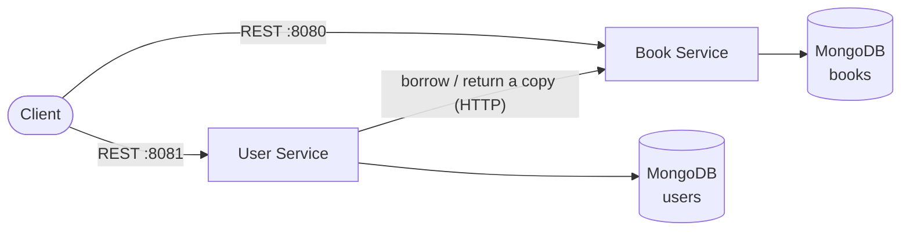

# Online Library Platform

A microservices library system for managing books, members and loans. It is built with
TypeScript, Express and MongoDB and runs in Docker. Over time it will grow into a complete
platform covering DevOps, data engineering and MLOps.

## About this project

This project started as **university coursework** for a DevOps and data module. The
original version was an online book-borrowing system with two Java Spring Boot
microservices, MongoDB and a plain HTML/JavaScript frontend. It was deployed to a
Kubernetes cluster provided by the university.

After the module, I **rebuilt it from scratch** as a portfolio project with three goals:

- **Own the whole stack.** Everything runs on my own machine and infrastructure, not on
  university servers.
- **Fix what the coursework got wrong.** I found and fixed bugs, race conditions and
  security issues in the original design (see below).
- **Keep building on it.** Add testing, CI/CD, Kubernetes, observability, an event-driven
  data pipeline and eventually an ML component, one phase at a time.

### What changed from the coursework version

| Area               | Coursework version                                                                 | This version                                                                          |
| ------------------ | ---------------------------------------------------------------------------------- | ------------------------------------------------------------------------------------- |
| Language           | Java 21, Spring Boot                                                               | TypeScript (Node.js 24), Express 5                                                    |
| Credentials        | Database password hard-coded in config files and Kubernetes YAML                   | Read from the environment, never committed                                            |
| Borrowing a book   | The **browser** called both services in turn and undid step one if step two failed | The **User Service** coordinates with the Book Service and undoes step one on failure |
| Concurrent borrows | Read, check, then save, so two people could take the last copy                     | One atomic database update, tested with simultaneous requests                         |
| Updating a book    | Missing fields were set to `null`, and available copies never updated              | Partial updates (`PATCH`), and available copies adjust correctly                      |
| Validation         | Annotations present but never enforced                                             | Every request validated with Zod, with clear `400` errors                             |
| Errors             | "Not found" and bad input often returned `500`                                     | Consistent JSON errors with the right status: `400`, `404`, `409`, `503`              |
| Loans              | A list stored inside each user record                                              | Their own collection, with a database rule of one active loan per member per book     |
| Databases          | One shared database                                                                | One database per service                                                              |
| Docker images      | Copied a pre-built JAR and ran as root                                             | Multi-stage build, production dependencies only, non-root user, health check          |

## Architecture



| Service          | Responsibility                                                  | Port  |
| ---------------- | --------------------------------------------------------------- | ----- |
| **Book Service** | Book catalogue and copy availability                            | 8080  |
| **User Service** | Members and loans. Coordinates borrowing with the Book Service. | 8081  |
| **MongoDB**      | Separate `books` and `users` databases, one per service         | 27017 |

### How borrowing works

1. The User Service checks that the member exists and doesn't already have the book.
2. It asks the Book Service to take a copy off the shelf. This is one atomic update, so
   the last copy can't be taken twice.
3. It records the loan. If that fails, it tells the Book Service to put the copy back.
   This undo step is called a _compensating action_.

Returning works the other way round: the loan is closed first, then the copy goes back on
the shelf. If the Book Service can't be reached, the loan is reopened and the client gets
a `503`, so nothing is left half-done.

This is a simple version of the **saga pattern**. It has one known weakness: if the User
Service crashes between steps, the undo never runs. Phase 3 replaces the direct HTTP call
with events (Kafka and the transactional outbox pattern) to close that gap.

## Tech stack

- **Runtime:** Node.js 24, TypeScript (strict), run directly by Node in development
- **API:** Express 5, Zod validation, Helmet, CORS
- **Data:** MongoDB 8, Mongoose 9
- **Logging:** pino, with readable output in development and JSON in production
- **Containers:** Docker multi-stage builds, Docker Compose
- **Code quality:** ESLint, Prettier, npm workspaces

## Getting started

### Prerequisites

- [Node.js 24+](https://nodejs.org/)
- [Docker Desktop](https://www.docker.com/products/docker-desktop/)

### Run everything in Docker

```bash
npm run docker:up
```

This builds both services and starts them with MongoDB. Check that they're up:

```bash
curl http://localhost:8080/health/ready
curl http://localhost:8081/health/ready
```

Follow the logs with `npm run docker:logs`. Stop everything with `npm run docker:down`;
your data is kept in a Docker volume.

### Run the services locally (for development)

```bash
npm install
docker compose up -d mongodb
```

Then start each service in its own terminal. Each one restarts automatically when you save
a file:

```bash
npm run dev -w @library/book-service
npm run dev -w @library/user-service
```

If you want to change a setting, copy a service's `.env.example` to `.env` and edit it.

### Useful scripts

| Command             | What it does                     |
| ------------------- | -------------------------------- |
| `npm run typecheck` | Type-check every service         |
| `npm run lint`      | Run ESLint                       |
| `npm run format`    | Format all files with Prettier   |
| `npm run build`     | Compile every service to `dist/` |

## Configuration

Every setting has a default for local development. When a service starts, it checks its
settings and stops immediately with a clear message if any are invalid.

| Variable                  | Service | Default                                       |
| ------------------------- | ------- | --------------------------------------------- |
| `PORT`                    | both    | `8080` (book) / `8081` (user)                 |
| `MONGODB_URI`             | both    | `mongodb://localhost:27017/books` or `/users` |
| `LOG_LEVEL`               | both    | `info`                                        |
| `CORS_ORIGIN`             | both    | `*`                                           |
| `BOOK_SERVICE_URL`        | user    | `http://localhost:8080`                       |
| `BOOK_SERVICE_TIMEOUT_MS` | user    | `5000`                                        |
| `LOAN_PERIOD_DAYS`        | user    | `14`                                          |

## API reference

### Book Service (`:8080`)

| Method   | Path                    | Description                                                          |
| -------- | ----------------------- | -------------------------------------------------------------------- |
| `GET`    | `/api/books`            | List books. Filters: `?search=` (title or author), `?available=true` |
| `POST`   | `/api/books`            | Add a book                                                           |
| `GET`    | `/api/books/:id`        | Get one book                                                         |
| `PATCH`  | `/api/books/:id`        | Update some fields of a book                                         |
| `DELETE` | `/api/books/:id`        | Delete a book (`409` if copies are on loan)                          |
| `POST`   | `/api/books/:id/borrow` | Take one copy off the shelf (`409` if none are left)                 |
| `POST`   | `/api/books/:id/return` | Put one copy back                                                    |

### User Service (`:8081`)

| Method   | Path                                  | Description                                                     |
| -------- | ------------------------------------- | --------------------------------------------------------------- |
| `GET`    | `/api/users`                          | List members. Filter: `?search=` (name, email or membership ID) |
| `POST`   | `/api/users`                          | Register a member. The membership ID is generated.              |
| `GET`    | `/api/users/:id`                      | Get one member                                                  |
| `PATCH`  | `/api/users/:id`                      | Update a member's name or email                                 |
| `DELETE` | `/api/users/:id`                      | Delete a member (`409` if they have books on loan)              |
| `GET`    | `/api/users/:id/loans`                | A member's loans. Filter: `?status=active\|returned\|overdue`   |
| `POST`   | `/api/users/:id/loans`                | Borrow a book: `{ "bookId": "..." }`                            |
| `POST`   | `/api/users/:id/loans/:loanId/return` | Return a loan                                                   |
| `GET`    | `/api/loans`                          | All loans. Filter: `?status=overdue` for the librarian's view   |

Both services also expose `GET /health`, which confirms the process is running (a liveness
check), and `GET /health/ready`, which confirms the database is reachable (a readiness
check).

### Example

```bash
# Add a book
curl -X POST http://localhost:8080/api/books \
  -H "Content-Type: application/json" \
  -d '{"isbn": "978-0-13-595705-9", "title": "The Pragmatic Programmer", "author": "David Thomas", "totalCopies": 3}'

# Register a member
curl -X POST http://localhost:8081/api/users \
  -H "Content-Type: application/json" \
  -d '{"name": "Ada Lovelace", "email": "ada@example.com"}'

# Borrow the book (use the ids returned above)
curl -X POST http://localhost:8081/api/users/<userId>/loans \
  -H "Content-Type: application/json" \
  -d '{"bookId": "<bookId>"}'
```

### Errors

Every error has the same shape:

```json
{
  "error": {
    "message": "Validation failed",
    "details": [{ "path": "title", "message": "Title is required" }]
  }
}
```

| Status | Meaning                                                                                                           |
| ------ | ----------------------------------------------------------------------------------------------------------------- |
| `400`  | Invalid input or malformed JSON                                                                                   |
| `404`  | The resource doesn't exist                                                                                        |
| `409`  | Conflicts with the current state: duplicate ISBN or email, no copies left, the record was changed by someone else |
| `502`  | The Book Service sent an unexpected response                                                                      |
| `503`  | The Book Service can't be reached                                                                                 |

## Project structure

```
library-platform/
├── services/
│   ├── book-service/        # Book catalogue and copy availability
│   │   └── src/
│   │       ├── config/      # environment settings, logger, database connection
│   │       ├── routes/      # URL paths → controllers
│   │       ├── controllers/ # read requests, send responses
│   │       ├── schemas/     # Zod request schemas (also generate the TypeScript types)
│   │       ├── services/    # business rules
│   │       ├── models/      # Mongoose models
│   │       ├── middlewares/ # error handling
│   │       └── errors/      # HTTP error classes
│   └── user-service/        # Members and loans (same layout, plus clients/ for the Book Service)
├── Dockerfile               # one multi-stage build shared by all services
├── docker-compose.yml       # the full stack for local development
├── infra/                   # Kubernetes and Terraform (coming in Phase 2)
└── docs/adr/                # decision records
```

## Roadmap

- [x] **Phase 0: Foundation.** TypeScript rebuild, validation, error handling, a safe
      borrowing flow, Docker and Docker Compose.
- [ ] **Phase 1: Software engineering.** Unit and integration tests, OpenAPI docs,
      authentication, an API gateway and a web frontend.
- [ ] **Phase 2: DevOps.** CI/CD with GitHub Actions, Kubernetes (Helm and Argo CD),
      Terraform and Azure, and observability (Prometheus, Grafana, OpenTelemetry).
- [ ] **Phase 3: Data engineering.** Kafka events with the transactional outbox pattern, a
      dbt warehouse, orchestration, and analytics dashboards.
- [ ] **Phase 4: MLOps.** A book recommendation model with MLflow, served on Kubernetes
      and monitored for drift.

## License

[MIT](LICENSE)
