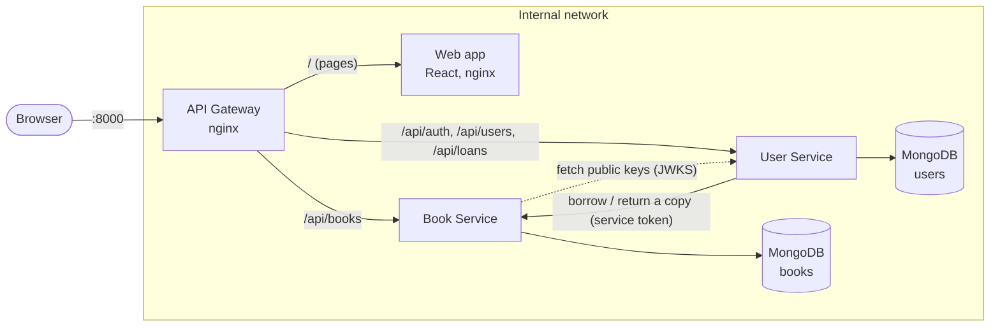
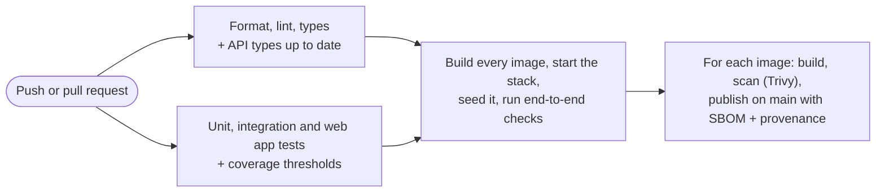
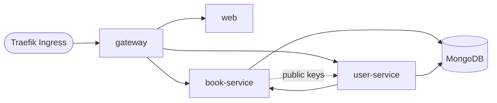

# Online Library Platform

[](https://github.com/JuliaLavagnini/library-platform/actions/workflows/ci.yml)

A microservices library system for managing books, members and loans, with a React web
app. It is built with TypeScript, Express and MongoDB and runs in Docker. Over time it will grow into a complete
platform covering DevOps, data engineering and MLOps.

## About this project

This project started as **university coursework** for a DevOps and data module. The
original version was an online book-borrowing system with two Java Spring Boot
microservices, MongoDB and a plain HTML/JavaScript frontend. It was deployed to a
Kubernetes cluster provided by the university.

After the module, I **rebuilt it from scratch** as a portfolio project with three goals:

- **Own the whole stack.** Everything runs on my own machine and infrastructure, not on
  university servers.
- **Fix what the coursework got wrong.** I found and fixed bugs, race conditions and
  security issues in the original design (see below).
- **Keep building on it.** Add testing, CI/CD, Kubernetes, observability, an event-driven
  data pipeline and eventually an ML component, one phase at a time.

### What changed from the coursework version

| Area               | Coursework version                                                                 | This version                                                                          |
| ------------------ | ---------------------------------------------------------------------------------- | ------------------------------------------------------------------------------------- |
| Language           | Java 21, Spring Boot                                                               | TypeScript (Node.js 24), Express 5                                                    |
| Credentials        | Database password hard-coded in config files and Kubernetes YAML                   | Read from the environment, never committed                                            |
| Authentication     | None: anyone could call any endpoint, including deleting books and users           | Login with JWTs, member and librarian roles, and service-to-service tokens            |
| Tests              | Only the default "does the app start" test                                         | About 240 unit, integration, concurrency, access and frontend tests                   |
| Frontend           | Plain HTML and JavaScript calling each service directly on hard-coded IP addresses | React and TypeScript app with API types generated from the OpenAPI docs, one origin   |
| Borrowing a book   | The **browser** called both services in turn and undid step one if step two failed | The **User Service** coordinates with the Book Service and undoes step one on failure |
| Concurrent borrows | Read, check, then save, so two people could take the last copy                     | One atomic database update, tested with simultaneous requests                         |
| Updating a book    | Missing fields were set to `null`, and available copies never updated              | Partial updates (`PATCH`), and available copies adjust correctly                      |
| Validation         | Annotations present but never enforced                                             | Every request validated with Zod, with clear `400` errors                             |
| Errors             | "Not found" and bad input often returned `500`                                     | Consistent JSON errors with the right status: `400`, `404`, `409`, `503`              |
| Loans              | A list stored inside each user record                                              | Their own collection, with a database rule of one active loan per member per book     |
| Databases          | One shared database                                                                | One database per service                                                              |
| Docker images      | Copied a pre-built JAR and ran as root                                             | Multi-stage build, production dependencies only, non-root user, health check          |
| Kubernetes         | Plain YAML with the database password inline, on a university cluster              | Helm chart on my own cluster: probes, autoscaling, locked-down pods, network policies |

## Architecture



| Component        | Responsibility                                                                            | Port                              |
| ---------------- | ----------------------------------------------------------------------------------------- | --------------------------------- |
| **API Gateway**  | The single entry point: routing, rate limiting, request IDs, hiding internal endpoints    | **8000** (the only one published) |
| **Web app**      | The React frontend, built to static files and served by nginx                             | 8080 (internal)                   |
| **Book Service** | Book catalogue and copy availability                                                      | 8080 (internal)                   |
| **User Service** | Accounts, login and loans. Issues tokens and coordinates borrowing with the Book Service. | 8081 (internal)                   |
| **MongoDB**      | Separate `books` and `users` databases, one per service                                   | 27017 (localhost only)            |

### The API gateway

Clients only ever talk to the gateway, an nginx container. The services have no published
ports, so they can't be reached from outside the Docker network. The gateway:

- **Routes** each path to the right service: API calls to the services, and every other
  path to the web app. It also serves both services' docs side by side.
- **Hides internal endpoints.** `/api/books/:id/borrow` and `/return` are only for the User
  Service, which calls the Book Service directly on the internal network. The gateway
  returns 404 for them, on top of the Book Service's own access check.
- **Rate-limits** each client to 20 requests per second (bursts of 40), with a stricter
  login limit inside the User Service. The services are told to trust exactly one proxy
  (`TRUST_PROXY=1`), so they see each client's real IP. Otherwise every request would seem
  to come from the gateway, and one person could use up everyone's login attempts.
- **Gives every request an ID**, returned in the `X-Request-ID` header and passed to the
  services. The same ID appears in the gateway's and the services' JSON logs, so one
  request can be followed end to end.
- **Returns clear errors**: JSON 404s for unknown paths, 429 when rate-limited, and 503
  when a service is down.
- Runs as a **non-root** user, and finds services again by name after they restart.

### How authentication works

1. A member signs up or logs in at the User Service and gets a **JWT access token**, valid
   for 15 minutes. Passwords are stored as **Argon2id** hashes.
2. Tokens are signed with an **Ed25519 private key that only the User Service holds**. It
   publishes the matching public key at `/.well-known/jwks.json`.
3. The Book Service verifies tokens with that public key. It can check a token is genuine
   but can never create one, so a leak from the Book Service can't be used to forge logins.
4. When the User Service calls the Book Service during a loan, it sends its own
   short-lived **service token**. Only that token may move copies, so nobody can take a
   copy off the shelf without a loan being recorded.

| Role          | Can do                                                                             |
| ------------- | ---------------------------------------------------------------------------------- |
| Anyone        | Browse books, sign up, log in                                                      |
| **Member**    | View and update their own profile. Borrow, list and return their own loans.        |
| **Librarian** | Everything a member can, for any member. Manage books and accounts, see all loans. |
| **Service**   | Only the User Service itself: take and return copies on the Book Service           |

Login is rate-limited to 10 attempts per minute per IP. A wrong password and an unknown
email get the same answer in the same time, so attackers can't find out which emails
have accounts.

### How borrowing works

1. The User Service checks that the member exists and doesn't already have the book.
2. It asks the Book Service to take a copy off the shelf. This is one atomic update, so
   the last copy can't be taken twice.
3. It records the loan. If that fails, it tells the Book Service to put the copy back.
   This undo step is called a _compensating action_.

Returning works the other way round: the loan is closed first, then the copy goes back on
the shelf. If the Book Service can't be reached, the loan is reopened and the client gets
a `503`, so nothing is left half-done.

This is a simple version of the **saga pattern**. It has one known weakness: if the User
Service crashes between steps, the undo never runs. Phase 3 replaces the direct HTTP call
with events (Kafka and the transactional outbox pattern) to close that gap.

## Tech stack

- **Runtime:** Node.js 24, TypeScript (strict), run directly by Node in development
- **Web app:** React 19, TypeScript, Vite, React Router, TanStack Query, a typed API client
  (`openapi-fetch`, with types generated by `openapi-typescript`), plain CSS with light
  and dark mode
- **API:** Express 5, Zod validation, Helmet, CORS, rate limiting
- **Auth:** JWT (EdDSA / Ed25519) with `jose`, Argon2id password hashing, JWKS
- **API docs:** OpenAPI 3.1 generated from the Zod schemas, Swagger UI
- **Data:** MongoDB 8, Mongoose 9
- **Logging:** pino, with readable output in development and JSON in production
- **Testing:** Vitest, Supertest, Testcontainers (a real MongoDB per test run), and Testing
  Library with Mock Service Worker for the web app
- **Containers:** Docker multi-stage builds, Docker Compose
- **Kubernetes:** Helm chart, k3d (k3s) for the local cluster, Traefik Ingress
- **Code quality:** ESLint, Prettier, npm workspaces

## Getting started

### Prerequisites

- [Node.js 24+](https://nodejs.org/)
- [Docker Desktop](https://www.docker.com/products/docker-desktop/)

### Run everything in Docker

First, create your `.env` file with a signing key and the first librarian account:

```bash
cp .env.example .env
npm run keys:generate
```

Paste the `JWT_PRIVATE_KEY=...` line that the second command prints into `.env`, and set
`BOOTSTRAP_LIBRARIAN_PASSWORD` (at least 12 characters). `.env` is ignored by git. Then:

```bash
npm run docker:up
```

This builds the services, the web app and the gateway and starts them with MongoDB.
Add some sample books, then open the app at **http://localhost:8000**:

```bash
npm run seed
```

Log in as the librarian from your `.env` to manage books, loans and members, or sign up
as a member to borrow. To check everything works, run the end-to-end tests. They log in,
borrow and return a book, and clean up after themselves:

```bash
npm run test:e2e
```

Follow the logs with `npm run docker:logs`. Stop everything with `npm run docker:down`;
your data is kept in a Docker volume.

### Run the services locally (for development)

```bash
npm install
docker compose up -d mongodb
```

Then start each service in its own terminal. Each one restarts automatically when you save
a file:

```bash
npm run dev -w @library/book-service
npm run dev -w @library/user-service
```

If you want to change a setting, copy a service's `.env.example` to `.env` and edit it.

### Work on the web app

With the Docker stack running, start the frontend's dev server. It reloads as you save,
and forwards API calls to the gateway, so the browser talks to one origin just like in
production:

```bash
npm run dev -w @library/web
```

Then open http://localhost:5173. If a service's API changes, regenerate the frontend's
types from the OpenAPI documents. Anything that no longer matches then fails to compile:

```bash
npm run api:generate -w @library/web
```

### API docs

Each service serves interactive docs, generated from the same Zod schemas that validate
requests, so they can't drift from the real API:

- Book Service: http://localhost:8000/docs/books/
- User Service: http://localhost:8000/docs/users/

Log in with `POST /api/auth/login`, then click **Authorize** and paste the `accessToken`
to try the protected endpoints. When running a service on its own with `npm run dev`,
its docs are at `/docs` and the raw spec at `/openapi.json`.

### Useful scripts

| Command                    | What it does                                                     |
| -------------------------- | ---------------------------------------------------------------- |
| `npm test`                 | Run all tests (needs Docker for the integration tests)           |
| `npm run test:unit`        | Unit and web app tests, no Docker needed (a few seconds)         |
| `npm run test:integration` | API tests against a real MongoDB in a throwaway container        |
| `npm run test:e2e`         | End-to-end checks against the running stack, through the gateway |
| `npm run test:watch`       | Re-run unit tests as you save                                    |
| `npm run test:coverage`    | Show which lines the tests cover                                 |
| `npm run seed`             | Add sample books to the catalogue (skips ones that exist)        |
| `npm run keys:generate`    | Print a new token-signing key for `.env`                         |
| `npm run k8s:up`           | Create the local Kubernetes cluster and install the platform     |
| `npm run k8s:down`         | Delete the local Kubernetes cluster                              |
| `npm run typecheck`        | Type-check every service and the web app                         |
| `npm run lint`             | Run ESLint                                                       |
| `npm run format`           | Format all files with Prettier                                   |
| `npm run build`            | Compile every service and the web app to `dist/`                 |

## Testing

About 240 tests cover both services and the web app, at over 90% line coverage:

- **Unit tests** check validation rules, token signing and verification, and the Book
  Service client with a faked `fetch`.
- **Integration tests** call the real Express apps with Supertest against a real MongoDB
  started by Testcontainers. Each test file gets its own database.
- **Concurrency tests** prove copy counts stay correct under load: 10 simultaneous borrows
  of a 3-copy book give exactly 3 successes.
- **Consistency tests** replace the Book Service with an in-memory fake and check that
  both services agree after every failure: a lost write, the Book Service being down, or
  the undo step failing.
- **Access tests** check every endpoint against every role, plus forged, tampered,
  expired and unsigned (`alg: none`) tokens.
- **A docs test** fails if an endpoint is added without being documented, or documented
  without existing.
- **Web app tests** render the whole app the way a user sees it (Testing Library) against
  a fake API at the network level (Mock Service Worker), so the real API client runs.
  They cover browsing, borrowing and returning, login redirects, the API's validation
  messages, automatic logout on an expired token, and the librarian pages.
- **End-to-end checks** (`npm run test:e2e`) run the whole flow against the real stack
  through the gateway, including checks on the gateway itself.

## Continuous integration

Every push to `main` and every pull request runs the [CI pipeline](.github/workflows/ci.yml)
on GitHub Actions:



- **Quality and tests run in parallel**; the end-to-end job only runs if both pass.
- **Integration tests use a real MongoDB** (Testcontainers, on the runner's Docker).
- **Coverage thresholds** fail the build if coverage drops (85% of lines, 75% of
  branches). The report is kept as a downloadable artifact.
- **The generated API types are checked**: if a service's API changed without
  regenerating the web app's types, the build fails.
- **End-to-end** builds all images, starts the stack with Docker Compose using
  throwaway secrets generated for that run, and runs `npm run test:e2e` through the
  gateway. Container logs are printed if anything fails.
- **Supply-chain safety:** third-party actions are pinned to exact commits, the workflow
  only has read access, and Dependabot opens weekly update PRs for npm packages, GitHub
  Actions and Docker base images, which then go through the same pipeline.

### Container images

After the end-to-end checks pass, each of the four images is built and **scanned with
[Trivy](https://trivy.dev)**. The build fails on any HIGH or CRITICAL vulnerability that
has a fix available, and the results appear in the repository's **Security** tab. On
`main`, images that pass are published to GitHub Container Registry:

| Image        | Registry path                                          |
| ------------ | ------------------------------------------------------ |
| Book Service | `ghcr.io/julialavagnini/library-platform/book-service` |
| User Service | `ghcr.io/julialavagnini/library-platform/user-service` |
| Web app      | `ghcr.io/julialavagnini/library-platform/web`          |
| API gateway  | `ghcr.io/julialavagnini/library-platform/gateway`      |

Each is tagged `sha-<commit>` (exact and never reused, for deployments) and `latest`.
Every published image has an **SBOM** (a list of every package inside it) and **build
provenance** (a record of how and where it was built) attached.

The images are kept small and hard to misuse:

- **Multi-stage builds**: build tools stay in the build stage.
- **Non-root users** in every container.
- **Service images contain only `node`**: npm, npx, corepack and yarn are removed, since
  nothing uses them at runtime and their own dependencies often have vulnerabilities.
- **nginx images drop `curl`**, which nginx never needs.
- **OS security updates are applied at build time**, so fixes published after the base
  image was built are included.

Scanning the images for the first time found 38 fixable HIGH and CRITICAL
vulnerabilities in each nginx image (an end-of-life nginx 1.29 base, plus `curl`) and
4 in each service image (npm's bundled packages). After these changes, all four images
have none.

## Kubernetes

The platform can also run on Kubernetes, using the [Helm chart](infra/helm/library-platform)
and the same images CI publishes. Locally it runs on a [k3d](https://k3d.io) cluster (k3s
inside Docker), side by side with Docker Compose.

### Run it locally

You need [Helm](https://helm.sh), [k3d](https://k3d.io) and `kubectl` (included with
Docker Desktop). On Windows:

```bash
winget install Helm.Helm
winget install k3d.k3d
```

With your `.env` in place (see [Getting started](#getting-started)):

```bash
npm run k8s:up
```

This creates the cluster from [infra/k3d/cluster.yaml](infra/k3d/cluster.yaml), creates
a Kubernetes Secret from the signing key and librarian in `.env`, installs the chart and
waits until everything is ready. The app is then at **http://localhost:8088**. Add sample
books and run the end-to-end checks against the cluster:

```bash
GATEWAY_URL=http://localhost:8088 npm run seed
GATEWAY_URL=http://localhost:8088 npm run test:e2e
```

By default the cluster pulls the images published by CI. To try local changes instead,
use `npm run k8s:up -- --local`: it builds the images on your machine and copies them
straight into the cluster. `npm run k8s:down` deletes the cluster and its data.

### What the chart deploys

| Component    | Kind                      | Replicas            |
| ------------ | ------------------------- | ------------------- |
| Book Service | Deployment + Service      | 2 to 5 (autoscaled) |
| User Service | Deployment + Service      | 2 to 5 (autoscaled) |
| Web app      | Deployment + Service      | 1                   |
| Gateway      | Deployment + Service      | 2                   |
| MongoDB      | StatefulSet + 1 GB volume | 1 (optional)        |
| Ingress      | Traefik → gateway         |                     |

- **Health probes.** A startup probe gives each service time to boot, a liveness probe
  restarts it if it hangs, and a readiness probe only sends it traffic while its database
  is reachable.
- **Autoscaling and availability.** Both services scale from 2 to 5 pods at 70% CPU, and
  a disruption budget keeps at least one pod of each running during maintenance.
- **Locked-down containers.** Every container runs as a non-root user with a read-only
  filesystem, no Linux capabilities, no privilege escalation and the default seccomp
  profile. None of them gets a Kubernetes API token.
- **Network policies.** Nothing can receive traffic unless allowed: only the Ingress
  controller can reach the gateway, and only the two services can reach MongoDB. Even a
  compromised pod couldn't reach the database unless it's one of those two.
- **No secrets in the chart.** The User Service reads its signing key and first librarian
  from a Secret created outside the chart, so every replica signs tokens with the same key.
- **Same images as Docker Compose.** Only configuration changes. For example, the gateway
  fills in its upstream addresses and DNS server from environment variables at startup.



_Every other connection between pods is blocked by the network policies._

### Starting without a start order

Kubernetes starts everything at once, so the services often start before MongoDB is
ready. Instead of crashing and being restarted, each service starts answering health
checks straight away, reports "not ready" until it connects, and retries the database
with increasing waits. A fresh install comes up with no restarts. When several User
Service pods start together, exactly one creates the first librarian account.

### Settings

Everything configurable is in [values.yaml](infra/helm/library-platform/values.yaml),
for example:

| Setting                   | Default                                                                    |
| ------------------------- | -------------------------------------------------------------------------- |
| `image.tag`               | `latest`: set an exact build, e.g. `sha-e53802f`, for reproducible deploys |
| `mongodb.enabled`         | `true`: set `false` and `mongodb.externalUri` to use a managed database    |
| `ingress.host`            | empty (any hostname): set a real domain when deploying publicly            |
| `bookService.autoscaling` | 2 to 5 replicas at 70% CPU                                                 |
| `networkPolicies.enabled` | `true`                                                                     |

### Known limitations

- **Login rate limiting is per pod.** With 2 User Service pods, a client gets up to 10
  attempts per minute on each. A shared store such as Redis would make it exact.
- **MongoDB is a single instance.** Fine locally; in production, use a managed database
  or a replica set.
- **Locally, every request comes from your own machine**, so client IPs all look the same
  in the cluster. In a cloud cluster the load balancer passes real client IPs through.

## Configuration

Every setting has a default for local development. When a service starts, it checks its
settings and stops immediately with a clear message if any are invalid.

| Variable                                  | Service | Default                                                   |
| ----------------------------------------- | ------- | --------------------------------------------------------- |
| `PORT`                                    | both    | `8080` (book) / `8081` (user)                             |
| `MONGODB_URI`                             | both    | `mongodb://localhost:27017/books` or `/users`             |
| `LOG_LEVEL`                               | both    | `info`                                                    |
| `CORS_ORIGIN`                             | both    | `*`                                                       |
| `TRUST_PROXY`                             | both    | `0` (Docker Compose sets `1`: the gateway)                |
| `JWT_ISSUER`                              | both    | `library-platform/user-service`                           |
| `JWT_AUDIENCE`                            | both    | `library-platform`                                        |
| `JWKS_URL`                                | book    | `http://localhost:8081/.well-known/jwks.json`             |
| `BOOK_SERVICE_URL`                        | user    | `http://localhost:8080`                                   |
| `BOOK_SERVICE_TIMEOUT_MS`                 | user    | `5000`                                                    |
| `LOAN_PERIOD_DAYS`                        | user    | `14`                                                      |
| `JWT_PRIVATE_KEY`                         | user    | none: a temporary key, which logs everyone out on restart |
| `ACCESS_TOKEN_TTL_MINUTES`                | user    | `15`                                                      |
| `AUTH_RATE_LIMIT_PER_MINUTE`              | user    | `10`                                                      |
| `BOOTSTRAP_LIBRARIAN_EMAIL` / `_PASSWORD` | user    | none: no librarian is created                             |

## API reference

### Book Service (`/api/books`)

| Method   | Path                    | Access    | Description                                                                                 |
| -------- | ----------------------- | --------- | ------------------------------------------------------------------------------------------- |
| `GET`    | `/api/books`            | public    | List books. Filters: `?search=` (title or author), `?available=true`                        |
| `GET`    | `/api/books/:id`        | public    | Get one book                                                                                |
| `POST`   | `/api/books`            | librarian | Add a book                                                                                  |
| `PATCH`  | `/api/books/:id`        | librarian | Update some fields of a book                                                                |
| `DELETE` | `/api/books/:id`        | librarian | Delete a book (`409` if copies are on loan)                                                 |
| `POST`   | `/api/books/:id/borrow` | service   | Take one copy off the shelf (`409` if none are left). Internal: not exposed by the gateway. |
| `POST`   | `/api/books/:id/return` | service   | Put one copy back. Internal: not exposed by the gateway.                                    |

### User Service (`/api/auth`, `/api/users`, `/api/loans`)

| Method   | Path                                  | Access            | Description                                                     |
| -------- | ------------------------------------- | ----------------- | --------------------------------------------------------------- |
| `POST`   | `/api/auth/register`                  | public            | Sign up as a member, and get a token                            |
| `POST`   | `/api/auth/login`                     | public            | Log in: `{ "email", "password" }` returns an access token       |
| `GET`    | `/api/auth/me`                        | logged in         | The logged-in account                                           |
| `GET`    | `/.well-known/jwks.json`              | public            | Public keys for verifying tokens                                |
| `GET`    | `/api/users`                          | librarian         | List members. Filter: `?search=` (name, email or membership ID) |
| `POST`   | `/api/users`                          | librarian         | Create an account, including librarians                         |
| `GET`    | `/api/users/:id`                      | self or librarian | Get one member                                                  |
| `PATCH`  | `/api/users/:id`                      | self or librarian | Update a member's name or email                                 |
| `DELETE` | `/api/users/:id`                      | librarian         | Delete a member (`409` if they have books on loan)              |
| `GET`    | `/api/users/:id/loans`                | self or librarian | A member's loans. Filter: `?status=active\|returned\|overdue`   |
| `POST`   | `/api/users/:id/loans`                | self or librarian | Borrow a book: `{ "bookId": "..." }`                            |
| `POST`   | `/api/users/:id/loans/:loanId/return` | self or librarian | Return a loan                                                   |
| `GET`    | `/api/loans`                          | librarian         | All loans. Filter: `?status=overdue` for the librarian's view   |

Both services also expose `GET /health`, which confirms the process is running (a liveness
check), and `GET /health/ready`, which confirms the database is reachable (a readiness
check). Both are public, as are `/docs` and `/openapi.json`.

### Example

```bash
# Sign up as a member (the response includes an accessToken and your user id)
curl -X POST http://localhost:8000/api/auth/register \
  -H "Content-Type: application/json" \
  -d '{"name": "Ada Lovelace", "email": "ada@example.com", "password": "correct horse battery staple"}'

# Browse the catalogue (no token needed)
curl http://localhost:8000/api/books

# Borrow a book (use your token, your user id and a book id from above)
curl -X POST http://localhost:8000/api/users/<userId>/loans \
  -H "Authorization: Bearer <accessToken>" \
  -H "Content-Type: application/json" \
  -d '{"bookId": "<bookId>"}'
```

Adding books needs a librarian token: log in as the librarian from your `.env`.

### Errors

Every error has the same shape:

```json
{
  "error": {
    "message": "Validation failed",
    "details": [{ "path": "title", "message": "Title is required" }]
  }
}
```

| Status | Meaning                                                                                                           |
| ------ | ----------------------------------------------------------------------------------------------------------------- |
| `400`  | Invalid input or malformed JSON                                                                                   |
| `401`  | Missing, invalid or expired token, or wrong email or password                                                     |
| `403`  | Logged in, but not allowed to do this                                                                             |
| `404`  | The resource doesn't exist                                                                                        |
| `409`  | Conflicts with the current state: duplicate ISBN or email, no copies left, the record was changed by someone else |
| `429`  | Too many login attempts: try again in a minute                                                                    |
| `502`  | The Book Service sent an unexpected response                                                                      |
| `503`  | Another service can't be reached (the Book Service, or the User Service's public keys)                            |

## Project structure

```
library-platform/
├── services/
│   ├── book-service/        # Book catalogue and copy availability
│   │   └── src/
│   │       ├── config/      # environment settings, logger, database connection
│   │       ├── routes/      # URL paths → controllers
│   │       ├── controllers/ # read requests, send responses
│   │       ├── schemas/     # Zod request schemas (also generate the TypeScript types)
│   │       ├── services/    # business rules
│   │       ├── models/      # Mongoose models
│   │       ├── middlewares/ # authentication, error handling
│   │       ├── docs/        # OpenAPI document
│   │       └── errors/      # HTTP error classes
│   │   └── tests/
│   │       ├── unit/        # no database needed
│   │       └── integration/ # real MongoDB via Testcontainers
│   └── user-service/        # Accounts, login and loans (same layout, plus clients/ for the Book Service)
├── frontend/                # React web app (Vite), its tests, Dockerfile and nginx config
├── scripts/                 # seed data, end-to-end checks, signing-key generator
├── Dockerfile               # one multi-stage build shared by all services
├── gateway/                 # nginx API gateway (config and Dockerfile)
├── docker-compose.yml       # the full stack for local development
├── .env.example             # settings for docker compose (copy to .env)
├── infra/
│   ├── helm/                # Helm chart for Kubernetes
│   ├── k3d/                 # local Kubernetes cluster definition
│   └── terraform/           # cloud infrastructure (coming later in Phase 2)
└── docs/adr/                # decision records
```

## Roadmap

- [x] **Phase 0: Foundation.** TypeScript rebuild, validation, error handling, a safe
      borrowing flow, Docker and Docker Compose.
- [x] **Phase 1: Software engineering.**
  - [x] Unit and integration tests (Vitest, Testcontainers)
  - [x] OpenAPI docs and Swagger UI
  - [x] Authentication and access rules (JWT, Argon2id, JWKS)
  - [x] An API gateway (nginx)
  - [x] A web frontend (React, TypeScript, Vite)
- [ ] **Phase 2: DevOps.**
  - [x] CI with GitHub Actions: quality, tests, end-to-end, coverage thresholds
  - [x] Container images: vulnerability scanning, SBOM and provenance, published to GHCR
  - [x] Kubernetes with Helm (local cluster)
  - [ ] GitOps with Argo CD
  - [ ] Observability: Prometheus, Grafana, Loki, OpenTelemetry
  - [ ] Terraform and Azure (AKS)
- [ ] **Phase 3: Data engineering.** Kafka events with the transactional outbox pattern, a
      dbt warehouse, orchestration, and analytics dashboards.
- [ ] **Phase 4: MLOps.** A book recommendation model with MLflow, served on Kubernetes
      and monitored for drift.

## License

[MIT](LICENSE)
